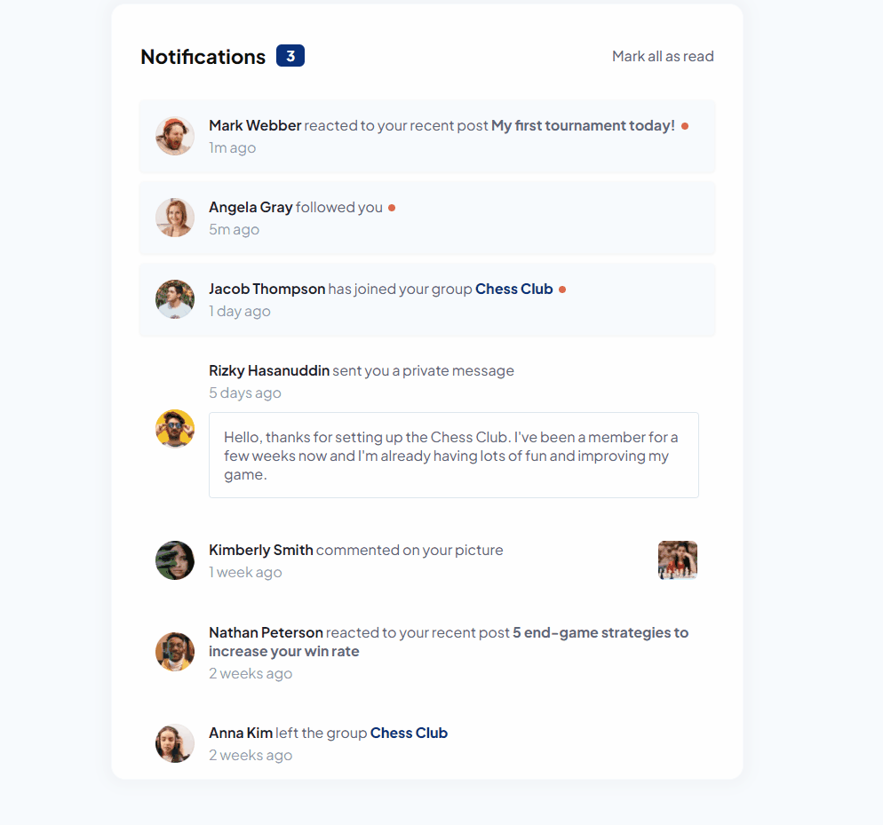

<h1 align="center"> Notifications page </h1>

A Frontend Mentor challenge.

  <a href="#-the-challenge">The challenge</a>&nbsp;&nbsp;&nbsp;|&nbsp;&nbsp;&nbsp;
  <a href="#-learning-goals">Learning goals</a>

  <a href="#-technologies">Technologies</a>&nbsp;&nbsp;&nbsp;|&nbsp;&nbsp;&nbsp;
  <a href="#-project">Project</a>&nbsp;&nbsp;&nbsp;|&nbsp;&nbsp;&nbsp;
  <a href="#-deploy">Deploy</a>

  

 

  

 

## 🏆 The challenge

The challenge was to build a notifications page that shows distinguished unread and read notifications styles. Also I added some interactions to mark notifications as read.

Users should be able to:

- Distinguish between "unread" and "read" notifications
- Select "Mark all as read" to toggle the visual state of the unread notifications and set the number of unread messages to zero
- View the optimal layout depending on their device's screen size
- See hover and focus states for all interactive elements on the page

 

## 🎯 Learning goals

Improve my skills with JavaScript DOM and make my first project using SASS.

 

## 🚀 Technologies

This project was built using following technologies:

- HTML
- SASS/CSS
- JavaScript
- GIT

 

## 💻 Project

I changed the mobile layout red balls size and positions to better user experience as I used them as a button to mark a single notification as read (just like Facebook).

 

## 🌎 Deploy

Live Site URL: [notifications-page-sass.vercel.app](https://notifications-page-sass.vercel.app/)
 
Solution URL: [Frontend Mentor Solution](https://www.frontendmentor.io/solutions/notifications-page-using-sass-MPCYoxQd2O)

---

#### :memo: License

This project is under a MIT license.
